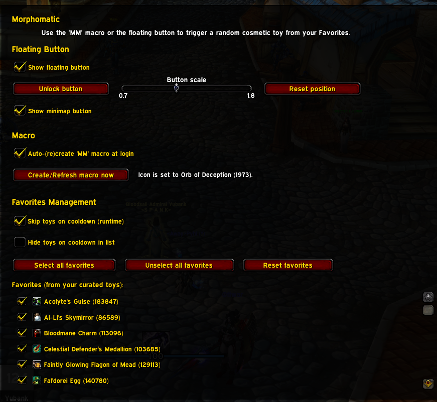

# Morphomatic

  

**Morphomatic** is a World of Warcraft addon that lets you **randomly transform your character** using your favorite cosmetic toys.  
Perfect for roleplayers, streamers, or anyone who enjoys spicing up their appearance between fights!

---

## ✨ Features
- **Random Toy Picker**: Use the `/mm` macro or the optional floating button to trigger a random transformation.  
- **Favorites Management**: Select/unselect/reset which toys are eligible in the in-game settings panel.  
- **Cooldown Handling**: Skip toys that are currently on cooldown, or hide them in the UI list.  
- **Macro Support**: Auto-create or manually recreate a macro (`/mm`) for easy access.  
- **Floating Button**: Movable, scalable, and lockable UI button to trigger toys without macros.  
- **Minimap Button**: Quickly open settings directly from your minimap.  
- **Localization**: English and French included.  
- **Embedded Libraries**: Works out of the box with LibStub, CallbackHandler-1.0, LibDataBroker-1.1, and LibDBIcon-1.0.  

---

## 📦 How to Use
1. Open the addon settings with `/mm options` or via **Interface → AddOns**.  
2. Select your favorite toys in the **Favorites** checklist.  
3. Use the `/mm` macro or click the floating button to transform!  

---

## 🖼 Screenshots

  
  

---

## 🔧 Installation

- **CurseForge**: [Download here](https://www.curseforge.com/wow/addons/morphomatic)  
- **Manual**: Download the latest release from [GitHub Releases](https://github.com/your-username/Morphomatic/releases) and extract into your `Interface/AddOns/` folder.

---

# 🇫🇷 Morphomatic

**Morphomatic** est un addon pour World of Warcraft qui permet de **transformer votre personnage aléatoirement** à l’aide de vos jouets cosmétiques préférés.  
Idéal pour les rôlistes, les streamers ou simplement pour varier votre apparence entre deux combats !

---

## ✨ Fonctionnalités
- **Sélecteur de jouet aléatoire** : utilisez la macro `/mm` ou le bouton flottant pour déclencher une transformation aléatoire.  
- **Gestion des favoris** : sélectionnez/désélectionnez/réinitialisez les jouets éligibles depuis le panneau d’options.  
- **Gestion des temps de recharge** : possibilité d’ignorer les jouets en recharge ou de les masquer dans la liste.  
- **Support macro** : création/recréation automatique d’une macro (`/mm`).  
- **Bouton flottant** : bouton d’UI déplaçable, redimensionnable et verrouillable.  
- **Icône minimap** : accès rapide aux options via votre minimap.  
- **Localisation** : anglais et français inclus.  
- **Librairies intégrées** : fonctionne immédiatement avec LibStub, CallbackHandler-1.0, LibDataBroker-1.1 et LibDBIcon-1.0.  

---

## 📦 Utilisation
1. Ouvrez les options avec `/mm options` ou via **Interface → AddOns**.  
2. Sélectionnez vos jouets favoris dans la liste **Favorites**.  
3. Utilisez la macro `/mm` ou le bouton flottant pour vous transformer !  

---

## 🖼 Captures d’écran

  
  

---

## 🔧 Installation

- **CurseForge** : [Télécharger ici](https://www.curseforge.com/wow/addons/morphomatic)  
- **Manuelle** : téléchargez la dernière version sur [GitHub Releases](https://github.com/eyolas/Morphomatic/releases) et extrayez le dossier dans `Interface/AddOns/`.

---

## 📜 License

Released under the [MIT License](LICENSE).
